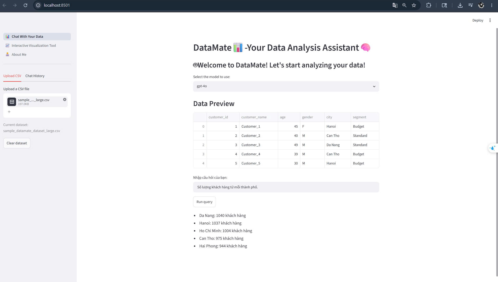

# DataMate — Trợ lý phân tích dữ liệu (Streamlit + LLM)

DataMate là ứng dụng Streamlit đa trang giúp bạn:
- Upload CSV và chat hỏi đáp trên dữ liệu.
- Tạo biểu đồ (Plotly/Matplotlib/Seaborn) và tải chart về PNG/JPG.
- Dùng nhiều LLM (OpenAI GPT, Google Gemini, NVIDIA/Llama) qua LangChain.



## Tính năng chính
- Chat với CSV (giữ dataset khi chuyển trang trong cùng session).
- Câu trả lời mặc định **luôn bằng tiếng Việt** để demo ổn định.
- Tạo/hiển thị biểu đồ và **tải về PNG/JPG** ngay dưới chart.
- Trình tạo biểu đồ tương tác ở trang “Interactive Visualization Tool”.

## Yêu cầu
- Python 3.9+ (khuyến nghị 3.10+)
- API key tùy model:
  - OpenAI: `OPENAI_API_KEY`
  - Gemini: `GOOGLE_API_KEY`
  - NVIDIA: `NVIDIA_API_KEY`

Tạo file `.env` ở thư mục gốc (cùng cấp `requirements.txt`), ví dụ:
```env
OPENAI_API_KEY=...
GOOGLE_API_KEY=...
NVIDIA_API_KEY=...
TUNNEL_TOKEN=...   # nếu dùng Cloudflare Tunnel (Docker)
```

## Cài đặt & chạy (không dùng Docker)
Clone repo:
```bash
git clone https://github.com/Tinhk4/DataMate.git
cd DataMate
```

Tạo virtualenv và cài dependencies:
```bash
python -m venv .venv

# Windows (PowerShell)
.\.venv\Scripts\Activate.ps1

# macOS/Linux
# source .venv/bin/activate

python -m pip install -U pip
pip install -r requirements.txt
```

Chạy app:
```bash
streamlit run 1_📊_Chat_With_Your_Data.py
```

## Chạy bằng Docker (tuỳ chọn)
Nếu bạn dùng Cloudflare Tunnel, set `TUNNEL_TOKEN` trong `.env` rồi chạy:
```bash
docker compose up --build
```
App sẽ mở ở `http://localhost:8501`.

## Ghi chú
- Xuất ảnh Plotly sang PNG/JPG cần `kaleido` (đã có trong `requirements.txt`).
- Nếu gặp lỗi quyền chạy script khi activate venv trên Windows, chạy PowerShell với:
  ```powershell
  Set-ExecutionPolicy -Scope Process -ExecutionPolicy RemoteSigned
  ```
